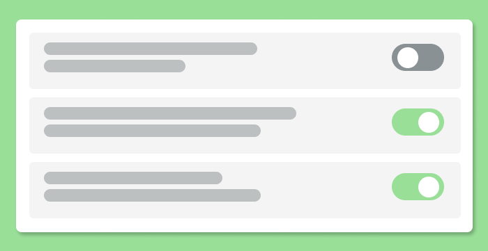
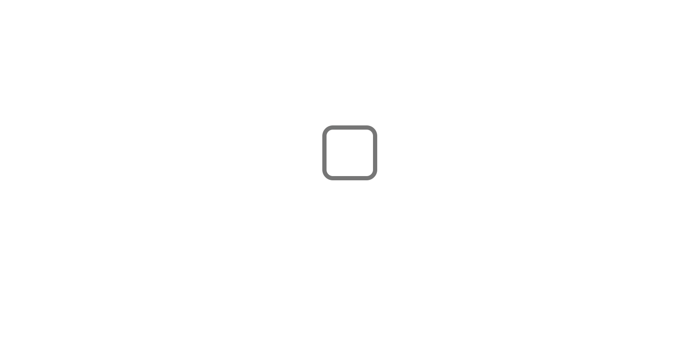
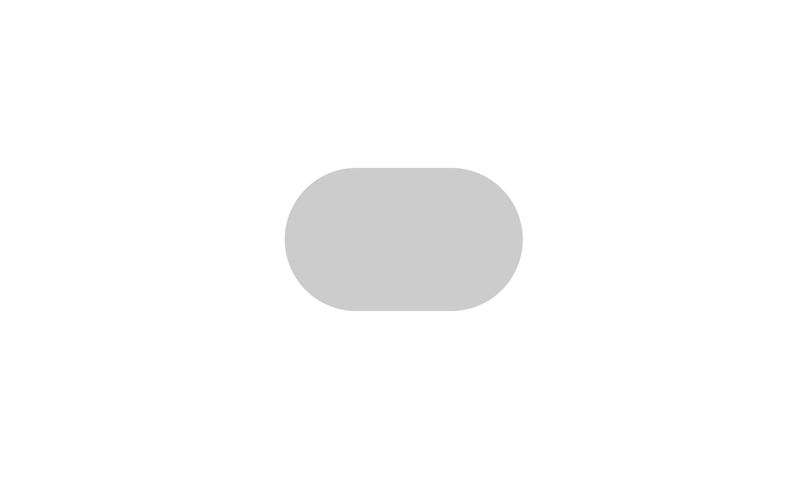
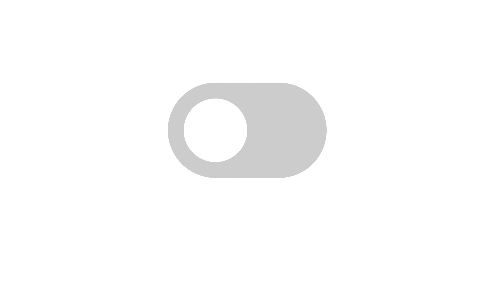
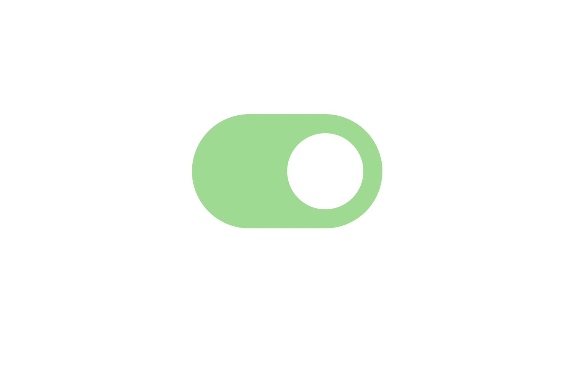

# css-toggle-switch
<div align="center">
    
</div>

Today, we’ll go over how we can transform a regular checkbox input element to a responsive toggle switch. It’s not as hard as you may think and only involves CSS. No JavaScript. So let’s get into it!

## HTML Markup
First things first, we’ll need to create an input in our HTML. We can create an input element and give it the `type` of `checkbox`.

```
<input type="checkbox">
```
And that’s it. That’s all the HTML we’ll need. The rest of the magic will all be done in the CSS.



## How to Style a Checkbox Input?

As mentioned above, we are taking a regular checkbox input and re-styling it to look like a toggle switch. You may have tried to style this element before and probably found out pretty quickly that it’s not easy, but don’t worry! It is actually possible to style this element.

In our CSS, let’s first begin by targeting our `checkbox` element and giving it some basic stylings. We’ll give it a background color, some border radius to give it that pill-like shape, and a few other basic styles.

```
input {
    -webkit-appearance: none;
    position: relative;
    width: 50px;
    height: 30px;
    border-radius: 25px;
    background-color: #ccc;
    transition: background .3s;
    outline: none;
    cursor: pointer;
}
```

Let’s go over this a bit so that we can understand what we’re doing here.

`-webkit-apperance`
> This is what removes the default look and feel of our input element when set to ‘none’. We use this so that we can see our custom stylings.

<br>

`position`
> relative – This is so that we can absolutely position the circle inside our toggle switch later.

<br>

`width` & `height`
> Gives us our toggle switches width and height.

<br>

`border-radius`
> This gives us 25px of border-radius on all four sides. Giving us a ‘pill-shaped’ container for our toggle switch.

<br>

`background-color`
> This sets the default background color for our toggle switch.

<br>

`transition`
> This gives a subtle change to the background-color when we click the toggle switch.

<br>

`outline`
> Optional, but removes the default outline given to input elements for accessibility.

<br>

`cursor`
> This just adds a pointer cursor when the user hovers over the toggle switch.

<br>

Here’s what you should see so far:



Now, to get that circle in the toggle switch (the part the user typically clicks on), we will need to use the `::after` pseudo-element.

We can write a new rule like this:

```
input::after { 

}
```

We can set the `content` property to `'';` and then set our position `absolute`. Because we set the position to `relative` in the initial `input` rule, our `::after` pseudo element will be positioned relative to its parent (the input element)

```
input::after {
    content: '';
    position: absolute;
    top: 50%;
    left: 30%;
    transform: translate(-50%, -50%);
}
```

For this example we can use these `top` and `left` values as well as the transform values of `-50%` for both the `y` and `x` axis, but feel free to play around with them to your liking.

Next, we can add `border-radius: 50%` to make it appear like a full circle. In order to do that though, we’ll also need the same `height` and `width` values. Go ahead and add in `height: 1.25rem;` and `width: 1.25rem;`. Now we just need to give it a background color of white.

Note: In order to get the circle to appear like it’s sliding, we’ll need to give the `left` property a transition. So we can add in something like `transition: left .3s`.

CSS for your `::after` pseudo element should look like this:

```
input::after {
    content: '';
    position: absolute;
    top: 50%;
    left: 30%;
    transform: translate(-50%, -50%);
    border-radius: 50%;
    height: 1.25rem;
    width: 1.25rem;
    background-color: white;
    transition: left .3s;
}
```



There we go! We’ve successfully styled the checkbox input element! It takes a little bit of work but I think this looks much better than the default styles that come with checkbox inputs.

Now, we need to adjust how it looks when the checkbox is checked. Thankfully, we don’t need any JavaScript for this. We are able to write CSS based on if the checkbox is clicked or not. It’s actually pretty simple.

## :checked Pseudo Class

We can write CSS for when a checkbox is in its `checked` state by writing the input selector followed by `:checked`. Here is what that looks like:

```
input:checked {

}
```

Whatever styles we choose to write in that CSS block will be applied when the checkbox is checked. So let’s go ahead and change the background color from that default gray color to a nice green.

```
input:checked {
    background-color: rgb(141, 221, 141);
}
```

Also, we’ll want to target the `::after` pseudo element when the checkbox is checked as well. We’ll want to move the circle from the `left: 30%` we initialized to something like `left: 70%`. We can do that by writing:

```
input:checked::after {
    left: 70%;
}
```

Depending if you’re using the same values I am or you’re using your own, you may need to adjust your `left` percentage. The full CSS should look something like this:
```
input {
    cursor: pointer;
    margin: 1rem auto;
    position: relative;
    width: 50px;
    height: 30px;
    border-radius: 25px;
    outline: none;
    background-color: #ccc;
    -webkit-appearance: none;
    transition: background .3s;
}

input::after {
    content: '';
    position: absolute;
    top: 50%;
    left: 30%;
    transform: translate(-50%, -50%);
    border-radius: 50%;
    height: 1.25rem;
    width: 1.25rem;
    background-color: white;
    transition: left .3s;
}

input:checked {
    background-color: rgb(141, 221, 141);
}

input:checked::after {
    left: 70%;
}
```
Now, once checked, your checkbox should look like this:



I sure hope this quick-guide on styling a checkbox to look like a toggle switch was helpful and you understand how we did it. You can completely transform your projects and apps with small things like this.

Until next time, have fun and happy coding!